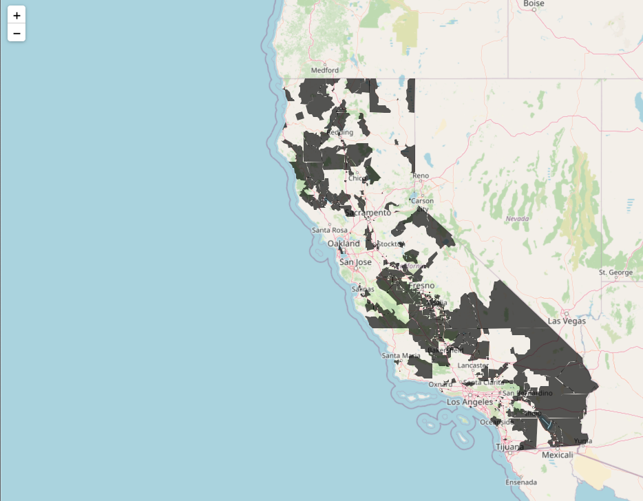

# sage-one-tree-planted-hackathon-2022
Code and artifacts of the Sage Tech Hackathon for Good for One Tree Planted

To launch an interactive demo click here 

# Interactive map of disadvantaged census tracts
Here is a map of disadvantaged census tracts that are
in California.
We are aiming to create layers of interactive maps that are the visualizations of
various customized configuration of disadvantaged census tracts, where One Tree Planted
can use them and embed in their website, showcasing their progress to the interested
parties.

# Repo setup

1. install python, for example with pyenv: `pyenv install 3.10.3`
2. install poetry: `pip install poetry`
3. use poetry to install the dependencies: `poetry install`

## Adding dependencies

- Just run `poetry add <library name>`

# Fire up a jupyter server and go from there
1. `poetry run jupyter notebook sage_one_tree_planted/notebooks`
